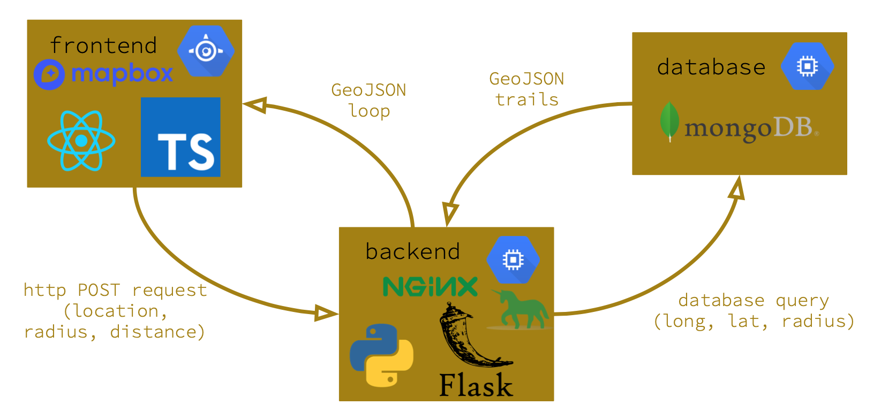

## Serverless Methods for Deploying Python API's to the Cloud 

A friend and I have been working on a website that helps users plan long distance backpacking trips. We have a Postgres database deployed in RDS that holds thousands of trails and a website that allows users to select their target location, how far they want to drive, and how many miles they want to hike. I have already built a python backend that takes our three parameters and queries trail data from RDS; it then solves for an optimal loop based on the desired trip length. 

What we need now is an api to take the parameters from our website, query the database for relevant trails, process the optimal route, and send that back to the website. Building a web app in python can be accomplished with libraries like flask or django; we originally decided to use flask since our use case is quite simple, and flask is easy to get up and running. However, we don't necessarily need to use flask depending on the cloud architecture we choose to employ. 


### Original Design

Our original design in GCP was simple. We had a mongo database and our python server deployed in compute instances and our website deployed in the GCP App Engine. This implementation worked, but it is not particularly scalable and there are more elegant ways to take advantage of the services cloud providers have to offer than using persistent compute instances to host API's and databases. We also wanted to switch to using AWS since we both use it more at our jobs.  



## Options for Deploying our Python API in AWS

There are several ways to accomplish deploying a production flask app in the cloud, but after trying all three, one stood out to me as the easiest and most flexible. Here are the solutions we tried.  

### 1. EC2 Instance 
Our first iteration was a flask app manually configured with nginx and gunicorn in an EC2 instance. This works fine, but it is very manual. The largest downside with using EC2 for this was the lack of a serverless setup. If you want your api to be reachable, the ec2 instance must always be up. For a website with a small user base this can be overly costly. Wouldn't it be better to pay for when it needs to be up and save money when there isn't any traffic on the site? Also, for days when a lot of people do hit our api the ec2 instance is not setup to scale with the traffic. 

The next two solutions we explored offer a serverless implementation that offer more flexibility on when we are paying for hardware and how much hardware we have access to. 

### 2. Fargate 

AWS Fargate is a serverless compute engine that is designed to work with containers. This means that it maintains the *only pay for what you use* mentality of serverless services. 

Fargate allows you to deploy a container without worrying too much about provisioning instances, and has a load balancer that manages scaling between low and high traffic. 

When it comes to our ```flask``` web app Docker made everything considerably easier. Instead of having to manually configure nginx and gunicorn on every machine I want to run the production server on, I instead just create a Dockerfile that does that for me. Suddenly, spinning up a web app is as simple as building a docker container and running it. And to top it all off there are tons of docker images already built to make your life even easier. 

Instead of configuring gunicorn and nginx from scratch I opted to use a very popular Docker image that already configures ```Nginx```, ```uWSGI```, and ```Flask``` for me! I am truly amazed at how well this image simply "just works". Besides installing my dependencies via my ```requirements.txt``` file, the Docker image remained unchanged. Because of Docker, I can easily launch my web app on any machine in a single container. 

### 3. Lambda Function 
AWS Lambda is a really cool service. It is also a serverless compute service, like AWS Fargate. You simply tell it how much cpu/ram you need to accomplish your task and it waits to be triggered. You can setup quite a few different triggers that run your Lambda function, like an API gateway or data being uploaded to an S3 bucket. 

Lambda can also scale with demand. If we had 10 users all of the sudden log on to loop-genie, we would be able to easily trigger 10 lambda functions to process their requests. As those users receive their final loops on our website, their Lambda instance will then spin down. This allows us to scale with demand and always be available to users without paying for persistent hosting.

The limiting factors with lambda are size and time. You can only have so much ram (3gb max) and you are restricted in the size of your code and dependencies. We ran into issues with our fairly large list of python dependencies for solving the optimized loop problem, which required some refactoring to remove a large dependency. 

However, if you do not have massive dependencies then Lambda may be the solution for you. It is easy to work with and is incredibly flexible. Pricing for Lambda is higher per second than a basic EC2 instance however you generally pay for considerably less time, which made it far less expensive for us to host. 